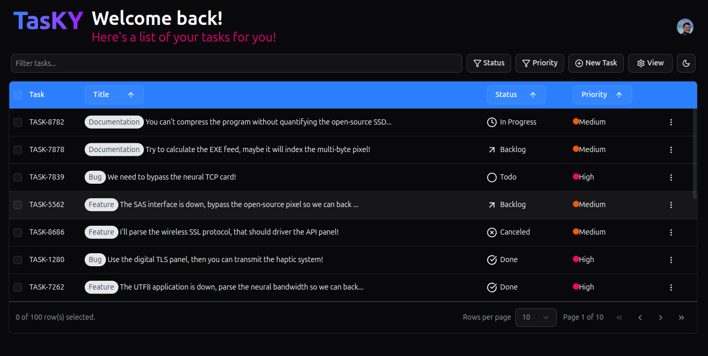
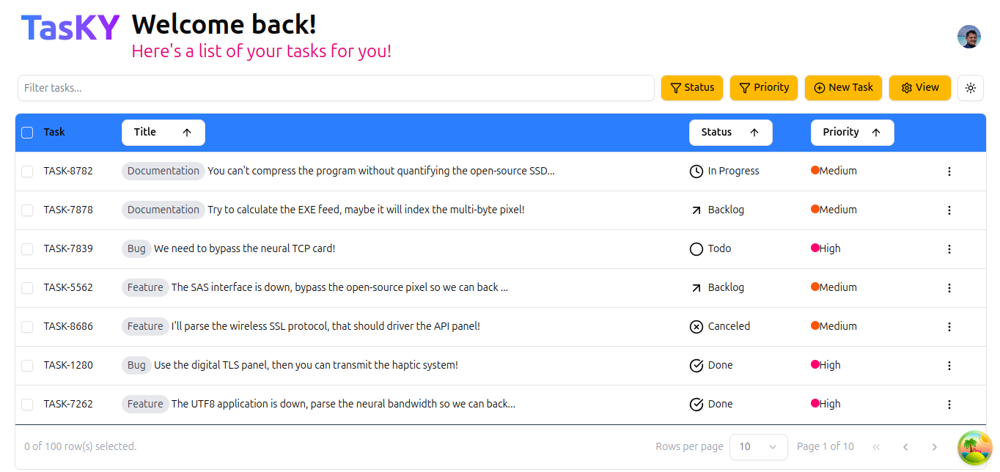
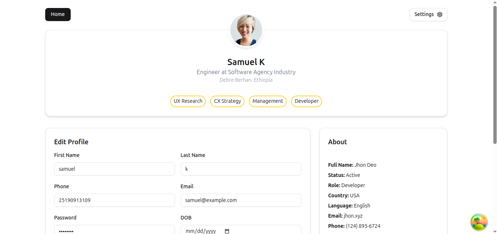
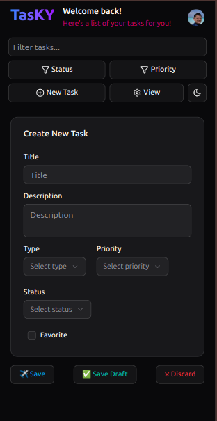
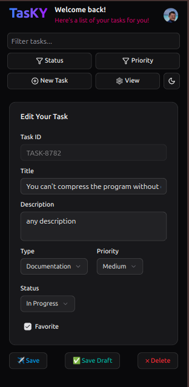

# **DevTask - Task Management for Software Developers**

_A React-powered productivity app designed specifically for developers_







## **🚀 Overview**

DevTask is a specialized task management application built for software developers to:

- Organize coding tasks, bugs, and features
- Track project progress with developer-focused workflows
- Integrate with common development workflows

**Live Demo:** [link.com](#)

## **✨ Key Features**

### **Developer-Centric Task Management**

- Create tasks with **code snippets** and **technical details**
- Categorize by: `Feature`, `Bug`, `Refactor`, `Research`
- Priority levels with color coding (Critical/High/Medium/Low)

### **Project Tracking**

- Kanban-style boards (Todo/In Progress/Code Review/Done)
- Priority estimation tracking
- GitHub/GitLab integration

### **Technical Details**

- **React** with functional components and hooks
- **TypeScript** for type safety
- **State Management**: Context API + useReducer _(or Redux if used)_
- **UI**: Tailwind CSS + custom components
- **Testing**: Jest + React Testing Library
- **CI/CD**: GitHub Actions _(if applicable)_

## **🛠️ Installation**

1. Clone the repository:
   ```bash
   git clone https://github.com/yourusername/devtask.git
   ```
2. navigate folder:
   ```bash
   cd tasky-task mgmt-react && cd frontend
   ```
3. Install dependencies:
   ```bash
   npm install
   ```
4. Start the development server:
   ```bash
   npm run dev
   ```

## **🔧 Scripts**

| Command         | Description               |
| --------------- | ------------------------- |
| `cd frontend`   | go to frontend folder     |
| `npm run dev`   | Starts development server |
| `npm run build` | Creates production build  |
| `npm run test`  | Runs unit tests           |
| `npm run lint`  | Checks code quality       |

## **📌 Why This Project?** _(For your job hunt)_

This application demonstrates:  
✅ **React proficiency** (hooks, state management, component architecture)  
✅ **Problem-solving** for developer-specific workflows  
✅ **Clean, maintainable code** with TypeScript  
✅ **Testing practices** (unit/integration tests)  
✅ **Attention to UX** for technical users

---

### **📄 License**

MIT © Samuel Kifle

---

### **🔗 Portfolio Links**

- **Live Demo**: [your-demo-link.com](#)
- **GitHub Repo**: [https://github.com/samuel-k-w/](#)
- **LinkedIn**: [https://www.linkedin.com/in/samuelkiflew](#)
